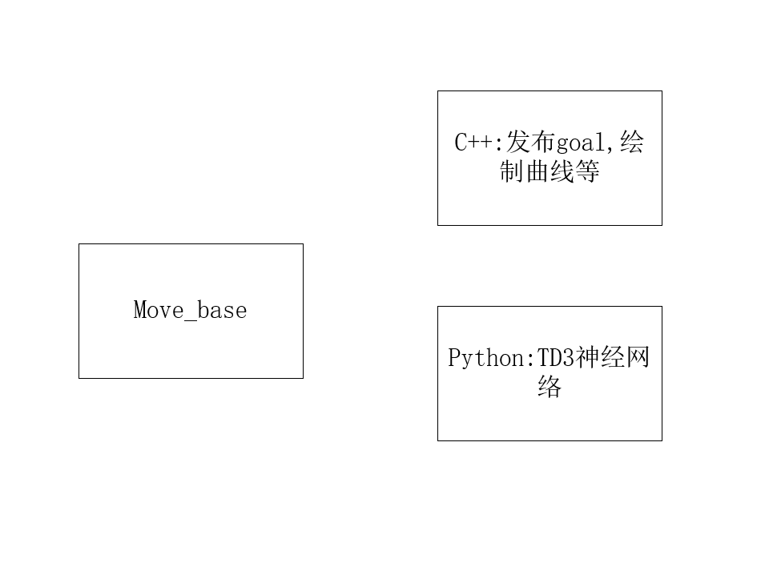

# 这是关于发布目标点和用于在rviz中显示的功能包文件夹

# 操作流程
`roslaunch px4 ego_swarm_2d_lidar.launch`

`roslaunch hector_slam_launch hector_slam_xtdrone.launch`

`cd ~/XTDrone/communication`
`python3 multirotor_communication.py iris 0`

`cd ~/XTDrone/sensing/slam/laser_slam/script`
`python3 laser_transfer.py iris 0 hector`

`cd ~/XTDrone/motion_planning/2d/launch`
`roslaunch 2d_motion_planning.launch`

`cd ~/XTDrone/control/keyboard`
`python3 multirotor_keyboard_control.py iris 1 vel`

撞墙/碰到代价地图、奖励降低

情况：可以正常发布目标，到达后可以返回SUCCESSFULLY reached the goal !
        但不可以循环发布，循环训练框架还没搭好
        gazebo  不可以在抵达目标后关闭箭头